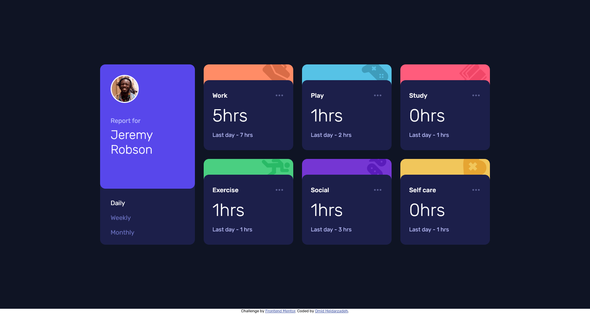

# Frontend Mentor - Time tracking dashboard solution

This is a solution to the [Time tracking dashboard challenge on Frontend Mentor](https://www.frontendmentor.io/challenges/time-tracking-dashboard-UIQ7167Jw). Frontend Mentor challenges help you improve your coding skills by building realistic projects. 

## Table of contents

- [Overview](#overview)
  - [The challenge](#the-challenge)
  - [Screenshot](#screenshot)
  - [Links](#links)
- [My process](#my-process)
  - [Built with](#built-with)
  - [What I learned](#what-i-learned)
  - [Useful resources](#useful-resources)
- [Author](#author)

## Overview

### The challenge

Users should be able to:

- View the optimal layout for the site depending on their device's screen size
- See hover states for all interactive elements on the page
- Switch between viewing Daily, Weekly, and Monthly stats

### Screenshot



### Links

- Solution URL: [code on GitHub](https://github.com/Omid-Heidarzadeh/Frontend-Mentor-Time-Tracking-Dashboard)
- Live Site URL: [live site on GitHub pages](https://omid-heidarzadeh.github.io/Frontend-Mentor-Time-Tracking-Dashboard/)

## My process

I've used mobile-first design approach, therefore: 
- started creating base HTML structure 
- created mobile layout using Grid & Flexbox
- added CSS styles
- added responsiveness using @media queries
- added basic functionality using Javascript 
- deployed result on GitHub pages
- refactored codes for better UI/UX, consistent rendering on different browsers
  and better accessibility.

### Built with

- Semantic HTML5 markup
- CSS custom properties
- Flexbox
- CSS Grid
- Mobile-first workflow
- Ajax & Json

### What I learned

This challenge helped me with better understanding & using CSS Grid. Also, I figured out that major browsers support "Variable Fonts" but their final rendering results have obvious differences. Therefore, I had to use non-variable fonts to get the same result on different browsers.
Validating HTML codes helped me with using semantic tags more efficiently. 
The Idea of retrieving required data from a JSON file led me to use and practice Ajax.

```js
async function ajax(url) {
  return new Promise((resolve) => {
    let xhr = new XMLHttpRequest();
    xhr.open('GET', url);
    xhr.onreadystatechange = function stateChangeHandler() {
      if (xhr.readyState == XMLHttpRequest.DONE) {
        if (xhr.status >= 200 && xhr.status < 400) {
          resolve(xhr.response);
        }
      }
    };
    xhr.send();
  });
}

export default function getTrackingData(url) {
  return new Promise((resolve) => {
    ajax(url).then((res) => {
      resolve(JSON.parse(res));
    });
  });
}
```
### Useful resources

- [Complete Guide Grid](https://css-tricks.com/snippets/css/complete-guide-grid/) - This is my #1 resource whenever i need to refresh my memory about CSS Grid details.

## Author

- GitHub - [Omid-Heidarzadeh](https://github.com/Omid-Heidarzadeh)
- Frontend Mentor - [@Omid-Heidarzadeh](https://www.frontendmentor.io/profile/Omid-Heidarzadeh)
- Linkedin - [Omid Heidarzadeh](https://www.linkedin.com/in/omid-heidarzadeh-112416146/)
